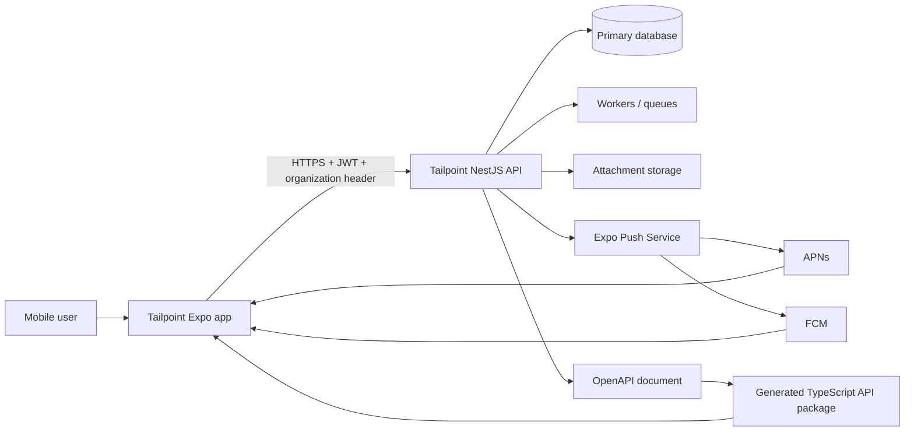

# Tailpoint Mobile App — Infrastructure and Architecture

**Status:** Proposed implementation contract  
**Document version:** 1.0  
**Last updated:** 2026-09-04  
**Related:** [Mobile App PRD](./MOBILE_APP_PRD.md), [Phase 3 Implementation Plan](../../phases/PHASE_3_IMPLEMENTATION_PLAN.md)

## 1. Architecture decision summary

Build Tailpoint Mobile as a new, independently releasable Expo/React Native application. Use Expo Router for navigation, TypeScript in strict mode, TanStack Query for remote state, Zustand for small client state, Expo SecureStore for refresh-token storage, React Hook Form plus Zod for forms, and a generated OpenAPI client for the backend contract.

The mobile app is another untrusted API client. It does not share database models, NestJS entities, server secrets, or authorization logic. The backend remains authoritative for identity, tenancy, permissions, entitlements, workflow transitions, dependencies, approvals, and validation.

Versions in this document are intentionally expressed as “current Expo-compatible” rather than pinned forever. Pin exact versions in the lockfile when scaffolding and upgrade through tested pull requests.

## 2. System context



## 3. Repository strategy

### Recommendation

Create a separate repository named `tailpoint-mobile` (or `track-a-project-mobile` if repository naming consistency is more important). Mobile has different signing credentials, release cadence, build artifacts, app-store access, and incident rollback mechanics from the web app.

Share API contracts through a generated private package or a pinned generated source artifact:

- Preferred after CI is available: backend CI publishes `@tailpoint/api-client` to the organization's private package registry from the canonical OpenAPI document.
- Acceptable for the first scaffold: generate `src/api/generated/` in the mobile repository and commit it, with CI failing if regeneration creates a diff.

Do not use Git submodules and do not import backend DTO/entity source files through filesystem paths. Those approaches couple unrelated build systems and can accidentally expose server-only code.

### Source-of-truth flow

```text
Nest DTOs/controllers
       ↓ Swagger generation
/api/docs-json or CI-exported openapi.json
       ↓ openapi-typescript (and openapi-fetch)
generated paths/components/client
       ↓
feature query and mutation hooks
       ↓
screens and components
```

Generated files are never manually edited. Mobile-specific view models and Zod schemas live outside the generated directory.

## 4. Recommended stack

| Concern | Choice | Boundary |
|---|---|---|
| Runtime | Expo managed workflow + React Native | Use development builds from the start |
| Language | TypeScript strict mode | No unchecked `any` at API/domain boundaries |
| Navigation | Expo Router | Protected route groups, native stacks/tabs, deep links |
| Remote state | TanStack Query | Fetching, cache, invalidation, retries, pagination |
| Client state | Zustand | Session metadata, UI preferences, transient drafts index |
| Secure persistence | `expo-secure-store` | Refresh token and device-scoped sensitive values only |
| General persistence | AsyncStorage initially | Non-sensitive preferences and query-cache metadata |
| Durable offline queue | `expo-sqlite` when enabled | Explicit drafts/outbox, migrations, conflict state |
| Forms | React Hook Form + Zod | Interactive validation; backend remains authoritative |
| API contracts | `openapi-typescript` + `openapi-fetch` | Generated from backend Swagger/OpenAPI |
| Styling | NativeWind + Tailwind CSS + typed design tokens | Utilities accelerate layout; semantic tokens remain the source of truth |
| Lists | React Native virtualized lists; FlashList if profiling warrants | Pagination required |
| Motion | React Native Reanimated | Only interaction/state clarification |
| Gestures | React Native Gesture Handler | Swipe actions and sheets where discoverable |
| Notifications | `expo-notifications` | Development build and physical-device testing |
| Builds/releases | EAS Build, Submit, Update | Separate development, preview, production profiles |
| Unit/component tests | Jest + React Native Testing Library | Domain helpers, hooks, and user-visible behavior |
| End-to-end tests | Maestro initially | Critical cross-platform smoke flows |
| Lint/format | ESLint + Prettier | Enforced in CI |

### Why Zustand and TanStack Query are both present

They solve different problems. TanStack Query owns server-derived resources such as projects, tasks, approvals, and notifications. Zustand owns small local coordination state such as selected organization metadata, theme choice, dismissed coach marks, and quick-create draft state. Server collections must not be duplicated into Zustand.

## 5. Proposed project layout

```text
tailpoint-mobile/
├── app.config.ts
├── eas.json
├── package.json
├── tsconfig.json
├── assets/
│   ├── branding/
│   ├── fonts/
│   └── icons/
├── src/
│   ├── app/                         # Expo Router routes only
│   │   ├── _layout.tsx
│   │   ├── (public)/
│   │   │   ├── welcome.tsx
│   │   │   ├── sign-in.tsx
│   │   │   └── sign-up.tsx
│   │   ├── (onboarding)/
│   │   │   ├── choose-workspace.tsx
│   │   │   └── index.tsx
│   │   └── (app)/
│   │       ├── _layout.tsx
│   │       ├── (tabs)/
│   │       │   ├── home.tsx
│   │       │   ├── projects.tsx
│   │       │   ├── inbox.tsx
│   │       │   └── you.tsx
│   │       ├── projects/[projectId]/
│   │       ├── tasks/[taskId].tsx
│   │       └── approvals/[approvalId].tsx
│   ├── api/
│   │   ├── generated/               # Generated, never hand-edited
│   │   ├── client.ts
│   │   ├── errors.ts
│   │   └── query-keys.ts
│   ├── components/
│   │   ├── primitives/
│   │   ├── feedback/
│   │   └── domain/
│   ├── features/
│   │   ├── auth/
│   │   ├── organizations/
│   │   ├── home/
│   │   ├── projects/
│   │   ├── tasks/
│   │   ├── dependencies/
│   │   ├── approvals/
│   │   └── notifications/
│   ├── design/
│   │   ├── tokens.ts
│   │   ├── theme.ts
│   │   └── typography.ts
│   ├── offline/
│   │   ├── drafts.ts
│   │   ├── outbox.ts
│   │   └── migrations/
│   ├── state/
│   │   ├── session-store.ts
│   │   └── preferences-store.ts
│   ├── telemetry/
│   ├── types/
│   └── utils/
└── e2e/
```

Route files remain thin. Business behavior belongs in feature hooks/services so it is testable without navigation.

## 6. Authentication and session pattern

### Token handling

- Keep the short-lived access token in memory only.
- Store the refresh token in Expo SecureStore using a service-specific key.
- Store selected organization ID as non-sensitive preference, but validate membership whenever a session is restored.
- Never store passwords or tokens in AsyncStorage, Zustand persistence, logs, analytics, crash metadata, URLs, or push payloads.
- On sign-out, attempt server revocation, then clear local secure/session/query/offline organization data even if the network request fails.

SecureStore protects local storage using platform facilities; it does not make a compromised device trustworthy and must not be treated as the only copy of irreplaceable user data.

### Required backend adjustment before beta

The current backend exposes refresh through `GET /api/auth/access-token?refreshToken=...`. Query strings commonly appear in proxies, diagnostics, and logs. Add a mobile-safe endpoint before beta:

```http
POST /api/auth/refresh
Content-Type: application/json

{ "refreshToken": "..." }
```

The endpoint should rotate refresh tokens, revoke the previous token atomically, return a short-lived access token plus replacement refresh token, and provide a stable reuse/revocation error. Keep the legacy web route temporarily if required, then deprecate it deliberately.

Also verify that login, signup, invitation acceptance, organization switching, password reset, and logout responses are fully described in OpenAPI.

### Bootstrap state machine

```text
unknown
  ├─ no refresh token ───────────────→ signed_out
  ├─ refresh succeeds ───────────────→ authenticated
  │                                      ├─ valid selected org → ready
  │                                      └─ no valid org ─────→ choose_org
  ├─ refresh is definitively rejected ─→ clear token → signed_out
  └─ refresh cannot reach network ─────→ offline_locked_or_cached_read
```

Do not interpret a timeout as an invalid credential. Do not open mutating routes based only on a decoded, expired JWT.

### Request pipeline

1. Feature calls the typed API client.
2. Client attaches `Authorization: Bearer <access-token>`.
3. For tenant routes, client attaches `x-organization-id` from validated session context.
4. On the first authentication failure caused by expiry, one single-flight refresh runs.
5. Requests waiting on that refresh retry once with the new access token.
6. A definitive refresh rejection clears the session; repeat loops are forbidden.
7. API errors normalize the backend envelope into typed `ApiError` categories.

Organization switching uses the backend switch endpoint. It must pause outgoing queries, obtain the new organization-scoped session if that is the current contract, clear all previous organization caches and drafts from active memory, then navigate to the new Home. Cache keys must always include organization ID.

### Route protection and deep-link preservation

Use Expo Router protected route groups driven by the completed bootstrap state. Capture a requested protected URL before sending a user to sign in or organization selection, validate its organization and resource authorization after authentication, then continue or fall back safely.

Workspace selection is an authenticated pre-app route, not part of the sign-in form. The route guard admits a user to `(app)` only after both identity and a currently valid organization context are resolved. The same selection feature is reused from the in-app organization switcher, with different presentation if desired.

## 7. API and shared types

### Contract rules

- Backend OpenAPI is the cross-repository contract.
- Generate request/response types and paths; do not share TypeORM entities.
- The backend error envelope is normalized centrally: `success`, `statusCode`, `error`, `message`, `details`, `timestamp`, and `path` where supplied.
- Dates cross the boundary as ISO 8601 strings and are converted at feature edges, never globally guessed.
- IDs retain their schema type; do not casually coerce string and numeric IDs.
- Unknown enum values degrade to a safe “Unknown” display rather than crashing an older installed app.
- Breaking API changes require a versioning or backwards-compatible rollout plan because installed mobile clients cannot all update immediately.

### Generation and drift checks

Backend CI should:

1. build and validate the Swagger/OpenAPI document without requiring production data;
2. lint it and detect breaking changes against the last released contract;
3. generate or publish the client artifact;
4. attach a contract version/commit SHA.

Mobile CI should regenerate from the pinned artifact and fail on unexpected diff. Feature code wraps generated operations in hooks such as `useTask`, `useUpdateTask`, and `useDecideApproval`; screens do not construct URLs.

### Compatibility additions recommended for mobile

- `POST /api/auth/refresh` with body token and rotation.
- Idempotency-key support for task creation, comments/attachments where needed, approval decisions, and any queued mutation.
- Stable conditional update/version field for conflict detection on mutable records.
- Device installation endpoints for push-token registration, rotation, preferences, and revocation.
- Explicit pagination metadata and bounded limits on every list endpoint.
- OpenAPI response decorators for existing endpoints that are currently inferred poorly.

### Refresh-session lifecycle

- Access tokens live only in process memory and identify their refresh-session
  family so organization switching can revoke only the calling device session.
- Refresh tokens are stored only in SecureStore on mobile. Each token has a
  persisted JTI, family ID, user, optional organization scope, expiry, revocation
  time, and replacement link; raw refresh tokens are never stored server-side.
- Refresh atomically consumes one active token and creates its replacement.
  Concurrent callers share one mobile refresh promise and wait for the same
  result rather than submitting the token more than once.
- Reuse of a consumed token is treated as possible credential theft and revokes
  all active tokens in that family. Other device-session families remain active.
- Logout revokes the current family and clears SecureStore plus in-memory access
  state. Feature query caches and drafts must also be cleared when their modules
  are introduced.
- A 401 API response is retried at most once after successful rotation. Refresh
  rejection clears the local session; network/timeouts will be classified
  separately so an offline device does not present an invalid-credentials error.
- Legacy refresh JWTs issued before persisted sessions are accepted only until
  their existing signed expiration, then migrate into a tracked family on their
  next successful refresh.

## 8. State ownership and caching

| Data | Owner | Persistence | Invalidation |
|---|---|---|---|
| Access token | Auth service memory | None | Refresh/sign-out |
| Refresh token | Auth service | SecureStore | Rotate/sign-out/revocation |
| Selected organization | Session store | Non-sensitive local storage | Membership change/sign-out |
| Projects/tasks/approvals | TanStack Query | Memory; reviewed persistence later | Mutations, focus, reconnect, push hint |
| Theme/preferences | Zustand | AsyncStorage | Immediate user change; restore before the first app frame |
| Form draft | Feature draft service | Memory or SQLite for explicit draft | Submit/discard |
| Mutation outbox | Offline service | SQLite | Confirmed/rejected/discarded |

Query keys start with the organization scope, for example:

```ts
['org', organizationId, 'projects', filters]
['org', organizationId, 'project', projectId, 'tasks', filters]
['org', organizationId, 'task', taskId]
['org', organizationId, 'approvals', filters]
```

Never rely on query invalidation alone when switching organizations; remove prior organization data from the active client.

## 9. Offline and synchronization model

### Foundation/MVP

- Detect connectivity but treat it as a hint; an available network does not guarantee API reachability.
- Cache recently viewed read data with visible stale state.
- Allow explicit local task drafts, comments, and attachment selections where feasible.
- Disable policy-sensitive actions such as approval decisions when the server cannot confirm current state.
- Retry safe reads automatically with bounded backoff; do not blindly retry mutations.

### Post-MVP outbox

Introduce SQLite only after online flows and backend idempotency are ready. Each outbox record contains an opaque local ID, organization, operation kind, server idempotency key, sanitized input, base record version, attempt state, timestamps, and safe error code.

Outbox invariants:

- process one organization's queue only under that organization's validated session;
- preserve operation ordering where operations depend on local predecessors;
- retry only classified transient errors with bounded backoff;
- stop on validation, authorization, missing-resource, workflow, or conflict failures;
- never queue approval decisions unless product and backend define safe concurrency semantics;
- show queued, syncing, failed, and confirmed states to the user;
- encrypt or avoid sensitive draft payloads after a dedicated threat review.

Conflict behavior is field/operation specific. Never use generic last-write-wins for status transitions, dependencies, assignees, or approvals.

## 10. Notifications and deep links

### Device registration

- Ask for notification permission only after an in-product explanation.
- Obtain the current Expo push token in a development/production build and register a device-installation record with user, platform, app version, environment, token, and preference categories.
- Update registration when the token changes and revoke it on sign-out where possible.
- The backend removes tokens reported invalid by the push provider.

Push notifications require development builds for realistic testing; Expo Go is not the acceptance environment.

### Payload contract

Payloads contain an event category plus opaque identifiers and route intent, not access tokens, comments, descriptions, attachment URLs, or unrestricted field values. Example:

```json
{
  "type": "approval.requested",
  "organizationId": "42",
  "subjectType": "approval",
  "subjectId": "901",
  "correlationId": "safe-opaque-id"
}
```

The app resolves fresh display data after opening. Foreground receipt invalidates or refetches targeted queries; it does not assume the notification is authoritative state.

### Link scheme

Support verified universal/app links for public invitations and authenticated resource navigation, with a custom scheme for development. Canonical intents include:

```text
/invite/:token
/projects/:projectId
/tasks/:taskId
/approvals/:approvalId
/inbox
```

All resource links pass through session, organization, entitlement, and authorization resolution.

## 11. Attachments

- Use the platform picker/camera only after contextual permission prompts.
- Validate type and size before upload, compress images when suitable, and strip unnecessary metadata where supported.
- Prefer backend-issued short-lived upload/download contracts; do not embed permanent storage credentials.
- Model upload progress, cancellation, retry, server processing, and failure separately from task save state.
- Store only temporary local URIs and metadata required for an explicit draft; clean abandoned files with a bounded maintenance job.

## 12. Configuration and environments

Maintain distinct application identities and backends:

| Profile | Purpose | Distribution | API |
|---|---|---|---|
| development | Local engineering/dev client | Internal | Development backend |
| preview | QA, stakeholder, pilot candidate | Internal/TestFlight/internal track | Staging backend |
| production | App stores | Store | Production backend |

Use EAS environments for build-time variables and credentials. `EXPO_PUBLIC_*` values are embedded in the app and must be considered public. Only public configuration such as API base URL, environment label, link host, and public telemetry DSN belongs there. Server secrets never ship in the bundle.

Use different bundle/application IDs for non-production builds, visually label development/preview, and ensure production cannot be pointed at a non-production API through an over-the-air update.

## 13. Builds, updates, and release controls

- Use development builds from the first integration sprint because notification and native behavior cannot be validated fully in Expo Go.
- Pin dependencies and commit the lockfile.
- CI on pull requests runs formatting, lint, strict typecheck, unit/component tests, generated-client drift, and Expo configuration validation.
- Protected branches create signed preview builds; tagged approved releases create production candidates.
- EAS Submit handles store submission only from an approved immutable commit.
- EAS Update channels map exactly to build environments. Runtime-version compatibility prevents incompatible JavaScript from reaching an older native binary.
- Production updates use staged rollout, monitoring, an emergency stop, and a documented rollback/republish procedure.
- Native dependency, permission, or configuration changes require a new store binary, not an over-the-air update.

## 14. Observability

Choose the crash/performance provider before pilot after privacy review. Wrap it behind `src/telemetry` so feature code uses product events rather than vendor APIs.

Required signals:

- crash-free sessions/users by app version, OS, and device class;
- app start and screen-ready timings;
- API latency/status category by operation name, never raw URL parameters;
- refresh, organization switch, push-open, deep-link resolution, upload, and outbox outcomes;
- release/build/runtime version and a backend-provided request/correlation ID.

Never record tokens, authorization headers, email/password fields, request bodies, task/comment content, attachment contents/URLs, invitation tokens, or unrestricted Custom Field values. Validate whether the existing Tailpoint monitoring SDK is React Native-compatible before reusing it; do not assume a browser/Node SDK works safely on mobile.

## 15. Security baseline

- TLS-only API communication; no production cleartext exceptions.
- SecureStore for refresh tokens; access tokens remain in memory.
- Token rotation, server revocation, short access-token lifetime, rate limiting, and reuse detection.
- Server-side authorization and tenant checks on every request; `x-organization-id` is context, not proof.
- No embedded private API keys or service-account credentials.
- Dependency and secret scanning in CI; lockfile review for native dependencies.
- Screenshot/clipboard restrictions and certificate pinning are explicit threat-model decisions, not default claims. Pinning adds operational risk and should be adopted only with a rotation/recovery design.
- Rooted/jailbroken devices may receive a warning or policy response for enterprise deployments, but detection is not a security boundary.
- Document account deletion, data export, privacy disclosures, permission purpose strings, and incident response before store submission.

## 16. Testing strategy

### Unit and component

- auth/session state machine and single-flight refresh;
- error normalization and retry classification;
- organization-scoped query keys and cache clearing;
- date/status/permission presentation;
- task forms, dependency restrictions, and approval confirmations;
- offline draft/outbox transitions;
- accessible names, roles, and dynamic type layouts.

### Contract and integration

- generated client against a deterministic test backend;
- login, refresh rotation/rejection, logout, invitation, organization switch;
- project/task pagination and mutation validation;
- dependency cycle/block behavior;
- approval stale/concurrent decision behavior;
- push registration and deep-link routing.

### End-to-end device matrix

At minimum, test current and oldest supported iOS/Android versions, a small phone, a large phone, light/dark themes, large text, reduced motion, slow network, offline recovery, cold push open, terminated deep link, expired session, and organization switching.

Critical release smoke:

1. sign in and restore a session;
2. open Home and a project;
3. create/update a task;
4. observe and resolve a dependency constraint;
5. open and decide an approval;
6. open a notification into the correct organization/resource;
7. sign out and verify local sensitive state is gone.

## 17. Implementation sequence

### Foundation 0 — contracts and design

- Confirm PRD decisions and mobile name.
- Inventory backend OpenAPI coverage and close auth/response gaps.
- Export brand assets and encode design tokens.
- Create the mobile repository, ownership rules, branch protections, and EAS project.

### Foundation 1 — running shell

- Scaffold the current stable Expo TypeScript Router template.
- Configure strict TypeScript, linting, formatting, aliases, fonts, themes, safe areas, error boundary, and test harness.
- Establish development/preview/production app config and build profiles.
- Build navigation skeleton, feedback primitives, and accessibility defaults.

### Foundation 2 — identity and contracts

- Add generated OpenAPI client and drift CI.
- Implement SecureStore-backed refresh, in-memory access token, protected routes, organization selection/switch, and normalized API errors.
- Add login/signup/invitation/onboarding screens.
- Produce physical-device development builds for both platforms.

### MVP 1 — daily work

- Home/My Work, projects, project overview, task list/detail/create/edit, comments, and attachments.
- Add server-state pagination, optimistic updates only where safely reversible, and explicit empty/error/offline behavior.

### MVP 2 — Phase 3 execution

- Dependencies, approval inbox/decisions, notifications, push registration, and authenticated deep links.
- Add privacy-reviewed telemetry and end-to-end critical-flow coverage.

### Pilot and hardening

- Accessibility audit, performance profiling, security/privacy review, store metadata, support/runbooks, staged preview rollout.
- Add explicit offline drafts first; enable a mutation outbox only after idempotency and conflict contracts pass integration tests.

## 18. Initial engineering backlog

- **MOB-001:** Create repository and current Expo Router TypeScript app.
- **MOB-002:** Implement Tailpoint design tokens, typography, primitives, System/Light/Dark themes, theme persistence, matching native system UI, icons, and native splash assets.
- **MOB-003:** Configure EAS project, three environments, bundle IDs, credentials ownership, and development builds.
- **MOB-004:** Audit/fix backend OpenAPI and automate client generation/drift detection.
- **MOB-005:** Add mobile-safe rotating refresh endpoint and auth contract tests.
- **MOB-006:** Implement session state machine, SecureStore adapter, API middleware, and error model.
- **MOB-007:** Implement protected navigation, deep-link preservation, organization selection, and cache isolation.
- **MOB-008:** Build Welcome, sign-in, sign-up/invitation, and onboarding flows.
- **MOB-009:** Build Home/My Work and project navigation.
- **MOB-010:** Build task list/detail/create/edit/comments and attachment pipeline.
- **MOB-011:** Build dependency presentation/mutations and blocked transition UX.
- **MOB-012:** Build approval inbox/detail/decision flows with concurrency handling.
- **MOB-013:** Add device registration, push handling, notification Inbox, and link routing.
- **MOB-014:** Add telemetry abstraction, privacy filters, dashboards, and release health gates.
- **MOB-015:** Add accessibility/performance/device test matrix and Maestro release smoke.
- **MOB-016:** Pilot explicit offline drafts; separately design and gate the SQLite outbox.

## 19. Architecture acceptance criteria

- System, Light, and Dark modes render every foundation and MVP screen correctly; the selected preference is restored before protected UI renders, and switching themes requires no restart.
- No token or organization-scoped server collection persists in an inappropriate store.
- A failed or simultaneous refresh cannot create a request loop or token race.
- Switching organizations cannot show stale records from the previous organization.
- Every API operation is generated or wrapped from the canonical contract and errors are normalized once.
- A push/deep link cannot bypass authentication, organization selection, entitlements, or backend authorization.
- Screens render deterministic loading, empty, stale/offline, forbidden, not-found, and failure states.
- Development, preview, and production builds are cryptographically and operationally separated.
- CI can reproduce the app, detect contract drift, and execute the critical test suite.
- Logs and telemetry pass the sensitive-data deny-list review.

## 20. Primary technical references

- [Expo Router authentication and protected routes](https://docs.expo.dev/router/advanced/authentication/)
- [Expo SecureStore](https://docs.expo.dev/versions/latest/sdk/securestore/)
- [Expo push notifications overview](https://docs.expo.dev/push-notifications/overview/)
- [Expo Notifications SDK](https://docs.expo.dev/versions/latest/sdk/notifications/)
- [EAS environment variables](https://docs.expo.dev/eas/environment-variables/)
- [EAS Build configuration](https://docs.expo.dev/build/eas-json/)

These references describe platform mechanisms, not Tailpoint authorization policy. Tailpoint's backend contracts and this document remain authoritative for product-specific behavior.
